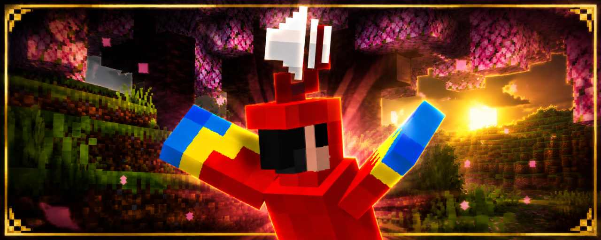

# PlasmoParrots

**PlasmoParrots** — это плагин для Paper и Plasmo Voice (аддон к PlasmoVoice), который позволяет попугаям поблизости подслушивать фрагменты реальной речи игроков и повторять их забавными писклявыми «попугайскими» голосами.

Плагин не генерирует текст, субтитры, шутки или заранее записанные реплики. Каждый повтор создаётся исключительно из настоящего голосового сообщения игрока, только что произнесённого через Plasmo Voice.

## Возможности

* Буферизует короткие фрагменты речи игроков из Plasmo Voice.
* Позволяет одному или нескольким попугаям отвечать со своих позиций.
* Повторяет фразы с повышенным тоном, заиканиями, сериями чириканья, прыжками назад по аудио, обрывами слогов и характерными «попугайскими» хвостами.
* Добавляет отдельный ползунок громкости **Parrots** в интерфейс Plasmo Voice.
* Поставляется с набором весёлых пресетов, делающих звучание более игрушечным, хаотичным и высоким.

## Требования

* Paper `1.21.4` или совместимая версия.
* Java `21`.
* Серверный плагин Plasmo Voice `2.1.9` или совместимая версия.
* Для прослушивания повторов игрокам необходим клиентский мод Plasmo Voice.

## Установка

1. Соберите плагин командой:

```bash
./mvnw clean package
```

2. Скопируйте файл `target/PlasmoParrots-1.0.0.jar` в папку `plugins/` вашего сервера.
3. Убедитесь, что Plasmo Voice установлен на сервере.
4. Запустите или перезапустите сервер.

## Поведение по умолчанию

Стандартная конфигурация специально настроена так, чтобы попугаи были активными и забавными:

* повторяют речь немного чаще;
* используют более короткие и выразительные фрагменты;
* несколько попугаев могут отвечать одновременно;
* звук заметно выше по тону;
* эффекты сильнее склоняются к пискам, чириканью, «гелиевым» голосам и игрушечным свисткам.

В результате плагин сразу создаёт ощущение «одержимых плюшевых попугаев», не превращая голосовой чат в полный хаос.

## Настройка

После первого запуска создаётся файл:

```text
plugins/PlasmoParrots/config.yml
```

### Полезные параметры

* `repeat-chance` — вероятность того, что выбранный попугай решит повторить фразу.
* `repeat-duration-*` — длина повторяемого фрагмента речи.
* `pitch-factor` — общий множитель высоты голоса перед применением эффектов.
* `parrots-max` и `parrot-stagger-*` — определяют, будут ли отвечать одиночные попугаи или целая стая.
* `effects` — набор эффектов, отвечающих за степень «сломанных игрушек» в звучании.

Если сервер начинает звучать слишком шумно, сначала уменьшите:

* `repeat-chance`
* `parrots-max`
* `pitch-factor`

## Команды

### `/plasmoparrots status`

Показывает состояние интеграции и текущие настройки плагина.

### `/plasmoparrots reload`

Перезагружает `config.yml`, очищает буферы и заново регистрирует источник звука.

### `/plasmoparrots debug on|off`

Включает или отключает режим отладки и сохраняет настройку в конфигурации.

### Алиасы

```text
/pparrots
/parrots
```

### Права

```text
plasmoparrots.admin
plasmoparrots.reload
```

## Интеграция с Plasmo Voice

PlasmoParrots регистрирует отдельный источник звука под названием **Parrots**.

Игроки могут изменить его громкость через меню:

```text
Plasmo Voice → Volume → Sources Volume → Parrots
```

Этот ползунок не влияет на обычный голосовой чат, поэтому можно оставить речь игроков громкой, а попугаев сделать тише.
